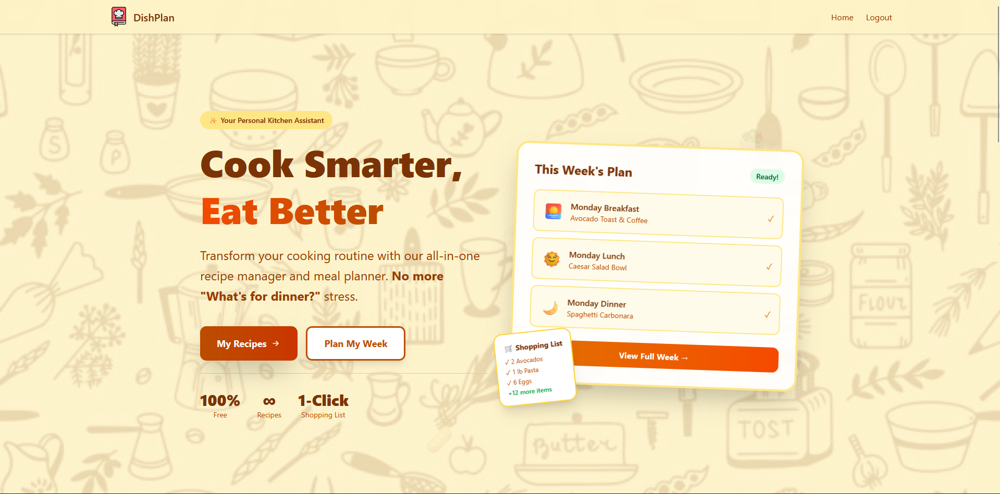
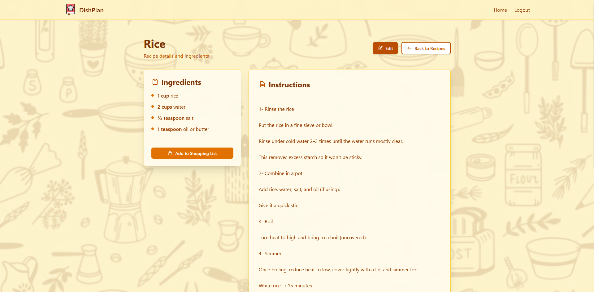
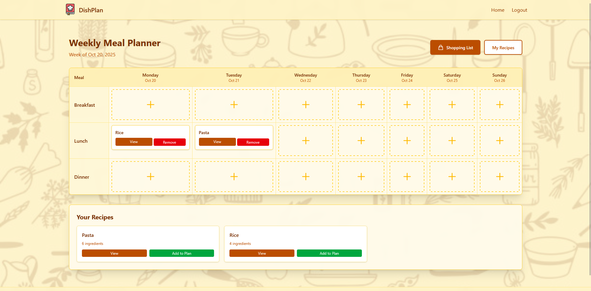

# 🍳 Recipe Book & Meal Planner
## Overview
A modern web application for managing recipes and planning weekly meals with automatic shopping list generation.

## 🚀 Technologies Used

### Backend
- **ASP.NET Core MVC 8.0** - Web framework
- **C#** - Programming language
- **Entity Framework Core** - ORM for database operations
- **SQL Server** - Database
- **ASP.NET Core Identity** - Authentication & authorization

### Frontend
- **Razor Views** - Server-side rendering
- **Tailwind CSS** - Utility-first CSS framework
- **Vanilla JavaScript** - Client-side interactivity
- **HTML5 & CSS3** - Modern web standards

## 🏗️ Architecture

The application follows a **layered architecture** with clear separation of concerns:

**Presentation Layer** → Controllers, Views, ViewModels  
**Service Layer** → Business Logic & Orchestration  
**Repository Layer** → Data Access & Queries  
**Data Layer** → Entity Framework Core, SQL Server

## ✨ Features

- 📖 **Digital Recipe Book** - Store and organize your favorite recipes
- 📅 **Weekly Meal Planner** - Drag-and-drop meal planning interface
- 🛒 **Auto-Generated Shopping Lists** - Consolidated ingredient lists from meal plans
- 👤 **User Authentication** - Secure personal recipe collections
- 📱 **Responsive Design** - Works on desktop, tablet, and mobile
- 🖨️ **Print-Friendly** - Print shopping lists and recipes

## 👨‍💻 Author

**Omar Afifi**
- GitHub: [@omarafifi-1](https://github.com/omarafifi-1)